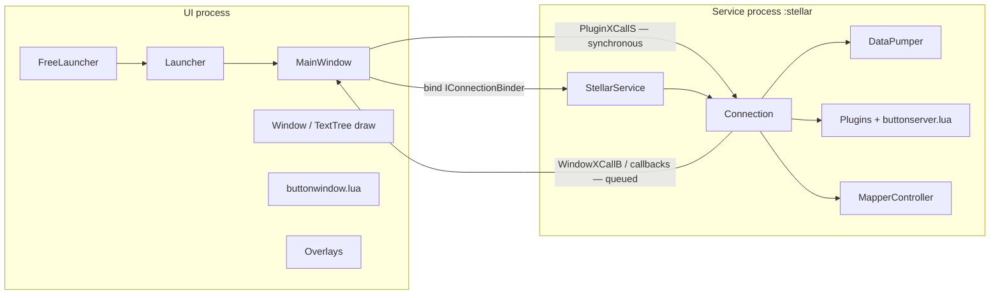
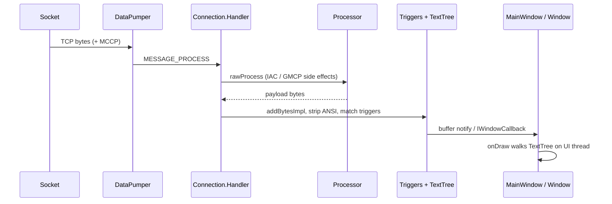
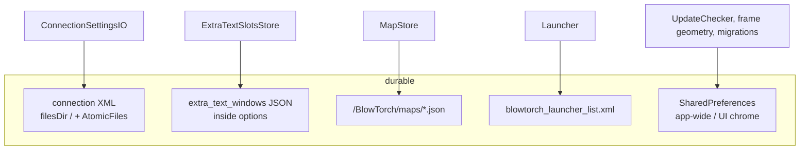

# How BlowTorch 2 is built

**As of 31 July 2026** · shipped tip **v2.2.0** (`versionCode` 253)

This is the architecture map for anyone taking on the codebase: human or
assistant. It describes **how the app is structured**, not how to play it and
not the day-to-day working rules.

| Document | Role |
|----------|------|
| **This file** | Architecture: modules, processes, packages, data flow, persistence |
| [`ORCHESTRATION.md`](ORCHESTRATION.md) | Working agreement: measure on device, traps, what not to “fix” |
| [`user-manual.md`](user-manual.md) | Player commands and Lua API |
| [`options-guide.md`](options-guide.md) | Every setting |
| [`README.md`](../README.md) | Public intro, build commands, privacy |

If a fact here conflicts with measured device behaviour, the device wins — and
[`ORCHESTRATION.md`](ORCHESTRATION.md) is the place that records those facts.

---

## 1. What this software is

BlowTorch is an Android MUD (Multi-User Dungeon) client: TCP telnet (and
extensions) to a game world, a scrollback terminal, aliases, triggers, timers,
on-screen buttons, Lua plugins, and — in this fork — a mapper, extra text
windows, GMCP tooling, and modern storage.

- **Original:** Daniel Block / Offset Null Entertainment, LLC (2010–2018), MIT
- **This fork:** BlowTorch 2 — same license, modern Android (min API 28,
  target/compile SDK 36)

Almost all application logic lives in Java under `BTLib/`. The installable app
is a thin shell (`BT_Free/`) that supplies the launcher entry, assets, and
product flavors.

---

## 2. Repository layout

```
BlowTorch/                    ← git root (open this as the Cursor workspace)
├── BTLib/                    Shared library: Java, AIDL, JNI .so packaging, tests
├── BT_Free/                  Application module: FreeLauncher, assets, flavors
├── LuaJIT-2.0.5/             Native LuaJIT sources (32-bit ABI build)
├── LuaJIT-2.1/               Native LuaJIT sources (64-bit / GC64 build)
├── docs/                     Guides and this architecture note
├── samples/                  Sample plugin / settings material
├── scripts/                  Maintainer helpers (e.g. StrictMode report)
├── fastlane/, metadata/      Store / F-Droid text
├── build_ndk_libraries.sh    Builds LuaJIT + ndk-build → BTLib/libs/
└── settings.gradle           Includes :BTLib and :BT_Free only
```

The parent folder outside this repo (`blowtorch-ressurection/`) is only a local
staging area for the latest APKs. It is **not** the git root.

| Path | What it is |
|------|------------|
| `BTLib/src/com/resurrection/blowtorch2/lib/` | Nearly all Java |
| `BTLib/src/.../*.aidl` | Binder IPC contracts (parcelables + interfaces) |
| `BTLib/jni/` | LuaJava / native module sources |
| `BTLib/libs/{armeabi-v7a,arm64-v8a}/` | Prebuilt `.so` (from the NDK script) |
| `BT_Free/assets/share/lua/5.1/` | Bundled Lua (buttons, tutorial, helpers) |
| `BT_Free/config/` | Default settings XML per flavor |
| `BTLib/src/test/java/` | JVM unit tests |
| `BTLib/src/androidTest/java/` | Instrumented tests |

---

## 3. Gradle modules and flavors

### Modules

| Module | Type | Namespace | Role |
|--------|------|-----------|------|
| **`:BTLib`** | Android library | `com.resurrection.blowtorch2.lib` | Code, AIDL, natives, resources, tests |
| **`:BT_Free`** | Android application | `com.resurrection.blowtorch2` | Thin app shell; depends on `:BTLib` |

(`:BT_Aard` exists in history but is commented out in `settings.gradle`.)

### Product flavors (`BT_Free`, dimension `edition`)

| Flavor | Application id | Label | versionName (as of this date) |
|--------|----------------|-------|-------------------------------|
| `production` | `com.resurrection.blowtorch2` | BlowTorch 2 | `2.2.0` |
| `btTest` | `com.resurrection.blowtorch2.test` | BlowTorch 2 Test | `2.2.0-test` |

Both share `versionCode` **253**. Typical variants: `productionDebug`,
`productionRelease`, `btTestDebug`, `btTestRelease`.

- **ABI:** `armeabi-v7a`, `arm64-v8a`
- **Java:** 17
- **Release:** minify on; unsigned by default (F-Droid/CI sign). Local signed
  release: `BT_LOCAL_SIGN=1` or `-PbtLocalSign`
- Flavor copies `config/default_settings_{main,test}.xml` → generated
  `res/raw/default_settings.xml`

### Native / LuaJIT build

Gradle does **not** compile the NDK libraries. Before a first build (or after
native changes):

```bash
export ANDROID_HOME=/path/to/Android/Sdk
export NDK_HOME=$ANDROID_HOME/ndk/<version>
./build_ndk_libraries.sh
./gradlew :BT_Free:assembleProductionDebug
```

Rough pipeline of `build_ndk_libraries.sh`:

1. Build LuaJIT 2.0.5 → static lib for `armeabi-v7a`
2. Build LuaJIT 2.1 (GC64) → static lib for `arm64-v8a`
3. `ndk-build` in `BTLib/jni` → `liblua.so` (LuaJava + LuaJIT) plus helpers
   (`lsqlite3`, `sqlite3`, `bit`, `marshal`, `luabins`)
4. Output under `BTLib/libs/<abi>/`, packaged via `jniLibs`

The Gradle build does **not** syntax-check Lua. After editing assets:

```bash
luac5.1 -p BT_Free/assets/share/lua/5.1/*.lua
```

---

## 4. Two processes (the shape of the runtime)

BlowTorch runs as **two Android processes** that share the same APK and class
loader, but **not** the same static fields or heap.



| | UI process | Service process (`:stellar`) |
|---|---|---|
| **Owns** | `MainWindow`, `Window` drawing, chrome, overlays, **buttonwindow** Lua | `StellarService`, `Connection`, socket, triggers/aliases/timers, plugins + **buttonserver** Lua, mapper engine |
| **Talks to** | The player | The MUD socket |

Declared in `BT_Free/AndroidManifest.xml`: activities use
`android:process="${appProcess}"` (the package name); `StellarService` uses
`android:process=":stellar"`.

`BlowTorchApp` runs in **both** processes (logging attach). A `static` field
exists **twice** — UI invalidation of a cache does nothing for the service.

### Binder asymmetry (load-bearing)

The two directions of IPC are **not** symmetric. Misreading this is the most
expensive wrong assumption in the project.

| Direction | Mechanism | Behaviour |
|-----------|-----------|-----------|
| **UI → service** | `IConnectionBinder.pluginXcallS` → `Connection.pluginXcallS` → `Plugin.xcallS` | **Synchronous.** Plugin Lua runs on the **calling (often UI) thread**. Slow Lua freezes the UI. |
| **Service → UI** | `WindowXCallB`, `IConnectionBinderCallback`, `IWindowCallback` | **Queued** onto the connection / UI handlers. Returns quickly. |

`SaveSettings` from Lua also posts onto that same handler queue. Whatever sits
in front of a button-set switch delays it — measured once at ~1.1s because a
settings save was ahead in the queue.

**When something is slow, ask which queue it is waiting in before hunting for
slow code.** Details and history: [`ORCHESTRATION.md`](ORCHESTRATION.md) Part 2.

### Main AIDL surfaces

| Interface / type | Role |
|------------------|------|
| `IConnectionBinder` | UI ↔ service API (connections, send, settings, aliases/triggers/timers, plugins, GMCP/MCP, mapper, frames) |
| `IConnectionBinderCallback` | Service → `MainWindow` (incoming paths, dialogs, mapper/extra-text/frame UI hooks, reload buttons, …) |
| `IWindowCallback` | Per-window: raw buffer updates, `xcallS`/`xcallB`, clear, encoding |
| `ILauncherCallback` | Launcher notified on disconnect |
| Parcelables | `WindowToken`, `AliasData`, `TriggerData`, `TimerData`, responders, settings options, `SlickButtonData`, … |

Implementation entry: `StellarService.onBind` → `ConnectionBinderFacade` → the
active `Connection`.

---

## 5. Entry points and screen flow

1. **`FreeLauncher`** — `MAIN` / `LAUNCHER`. Invisible hand-off so a pinned icon
   keeps working; starts `Launcher` and finishes.
2. **`Launcher`** — server / profile list (`blowtorch_launcher_list.xml`).
3. **`MainWindow`** — `singleTask` game UI; binds `StellarService`.
4. **`StellarService`** — foreground service (`foregroundServiceType=specialUse`),
   holds open connections while the UI may be backgrounded.

Permissions of note: Internet + FGS (required to play), notifications (useful),
all-files access (optional, for a visible `/BlowTorch/` tree),
`SYSTEM_ALERT_WINDOW` (optional, floating buttons over the IME).

---

## 6. Package map (`BTLib`)

All under `com.resurrection.blowtorch2.lib`.

### `service/` — connection engine (service process)

| Piece | Responsibility |
|-------|----------------|
| `StellarService` | Foreground service, connection map, binder |
| `Connection` | Central hub (~thousands of lines): handler messages, pipeline, facades |
| `ConnectionBinderFacade` | AIDL → active `Connection` |
| `DataPumper` | TCP read/write threads; MCCP inflate |
| `Processor` | Telnet IAC, option negotiation hooks, GMCP extraction |
| `Colorizer` | ANSI / xterm colour codes |
| `OptionNegotiator`, `McpEngine` | Telnet options; MCP |
| `ConnectionSettingsIO` | Load/save profile XML |
| `ConnectionAliases` / `Triggers` / `Timers` | Feature facades |
| `ConnectionGmcp`, `ConnectionExtraText`, `ConnectionReconnect`, `ConnectionSessionLog` | Focused helpers |
| `GMCPData`, `GmcpModuleRegistry`, `GmcpCharLogin`, `GmcpMediaPlayer` | GMCP |
| `MudstdFrame`, `FrameEvent` | In-band / GMCP frames |
| `function/` | Dot-commands (`.map`, `.gmcp`, `.timer`, …) |
| `plugin/` | `Plugin`, Lua `JavaFunction` packs, settings XML parsers |

### `window/` — UI process

| Piece | Responsibility |
|-------|----------------|
| `MainWindow` | Activity, binder callbacks, overlay hosts |
| `Window` | Terminal view; **`mBuffer` is UI-thread only** |
| `TextTree` | Line model (ANSI → spans); Connection may mutate *working* trees off-UI |
| `ChromeController` | Input bar, IME lift, toolbar / FAB |
| `ExtraTextOverlayController` + `ExtraTextSlot(s)` | Extra text panes |
| `MapperOverlayController` + related dialogs live partly in `mapper/` | Map UI |
| `FrameOverlayController`, `FrameImageStore` | Frame image overlays |
| `FloatingButtonController` / `FloatingLayer` | Floating button copies |
| Editors / dialogs | Plugin selection, Lua dialogs, gesture helpers |

### `mapper/` — engine in service, overlay in UI

`MapperController`, `MudMap`, `MapTile`, `MapLevel`, `MapExit`, `MapStore`,
`MapPathfinder`, `MapConflictDetector`, `MapperView`, `MapperOverlayController`,
`MapperUiBridge`, editors and browsers. Maps are JSON on disk; scoped by
`hostHint` / world.

### Feature packages

| Package | Role |
|---------|------|
| `alias/` | Aliases + editors + `AliasData` |
| `trigger/` | Triggers, groups, `condition/` state machine |
| `timer/` | Named timers |
| `responder/` | Trigger/timer actions: gag, replace, color, ack, script, toast, notification, setvariable |
| `button/` | Button set data (`SlickButtonData`) |
| `speedwalk/` | Speedwalk / direction data |
| `script/` | Plugin script metadata |
| `settings/` | `ConfigurationLoader`, legacy hyper settings helpers |
| `launcher/` | Server list, backups, builtin tutorial, profile discovery |
| `util/` | `AtomicFiles`, `BlowTorchLogger`, `SessionLogger`, `UpdateChecker`, … |
| `ui/` | `SDCardUtils`, permissions, colour helpers |
| `legacy/` | Older gesture / flipper utilities still referenced |
| `validator/`, `docs/` | Validation; Doxygen-style plugin doc holders |

### LuaJava

`org.keplerproject.luajava` — JNI bridge to `liblua.so`. Plugins obtain a
`LuaState` via `LuaStateFactory`; paths set through `LuaLibraryHelper`.

---

## 7. Data flow

### Inbound: MUD bytes → pixels



1. **`DataPumper`** reads the socket (optionally MCCP-decompresses) and posts
   `MESSAGE_PROCESS` to `Connection`.
2. **`Processor.rawProcess`** handles telnet IAC and pulls GMCP (and related)
   out of band; remaining bytes are the display/trigger stream.
3. Optional **MCP** filter (`McpEngine`) may rewrite the stream.
4. Bytes enter a working **`TextTree`** (`addBytesImpl` — colour / CSI holdover
   across packet boundaries).
5. **`Colorizer.stripAnsiEscapes`** feeds the amalgamated trigger matcher and
   session logging.
6. Matching **triggers** run **responders** (gag, replace, colour, script, …)
   on the connection thread.
7. Finished lines land in the main **`WindowToken`** buffer; the UI is notified
   over AIDL and **`Window`** draws on the UI thread only.

**GMCP** is mostly out-of-band: mapper sync, extra-text routing, frames, module
status. It does not have to pass through the main line buffer unless feed/show
options say so.

### Outbound: input → aliases → socket

1. Player types (or a button / Lua / timer sends).
2. UI calls `IConnectionBinder.sendData` → `Connection` send path.
3. Dot-commands (`.map`, `.run`, …), **alias** expansion (plugin
   `doAliasReplacement`), semicolon splitting, local echo.
4. IAC-escaped bytes → `DataPumper` writer thread → socket.

### Substitution (three mechanisms)

| Syntax | Where | Source |
|--------|-------|--------|
| `$1`, `$2`, … | **Trigger** action | Captures from the **MUD line** |
| `$1`, `$2`, … | **Alias** expansion | Captures from **what the player typed** |
| `${name}` | Either | Session variable (`SetVariable` / Lua) |

Alias expansion modes live in `AliasExpansion` — do not treat “regex alias”
behaviour as one branch forever without reading that type.

---

## 8. Thread ownership (short version)

| Object | Rule |
|--------|------|
| `Window.mBuffer` | **UI thread only.** `onDraw` walks the list; off-thread mutation is a crash. |
| `Connection` working `TextTree`s | May be mutated on the connection thread — barrier is in `Window`, not `TextTree`. |
| Triggers | Connection thread |
| Timers | Timer thread — share nothing unsafe with trigger fields |
| Plugin Lua via `pluginXcallS` | Calling thread (often UI) |

There is deliberately **no** lock around the draw buffer: a lock would tax every
frame for a race that the architecture already forbids. Full traps:
[`ORCHESTRATION.md`](ORCHESTRATION.md).

---

## 9. Settings and persistence



| Store | Contents |
|-------|----------|
| **Per-connection XML** | Profile: aliases, triggers, timers, plugins, options, windows. Path under app `filesDir`, name from sanitized display. Written with **`AtomicFiles`** (and `.bak`). |
| **`extra_text_windows`** | JSON option → `ExtraTextSlot` geometry and routing. Extra-text `WindowToken`s are **rebuilt** at runtime and are **not** serialised as normal windows. |
| **Maps** | `MapStore` → `/BlowTorch/maps/<name>.json` (or app-external fallback). Filtered by `hostHint`. |
| **Launcher list** | `blowtorch_launcher_list.xml` via AtomicFiles |
| **SharedPreferences** | App-wide concerns: update check, some frame/chrome geometry, migrations, tips — **not** the main MUD profile |
| **SD tree** (`SDCardUtils`) | Optional visible `/BlowTorch/{settings,backups,launcher,maps,session_logs,logs}/` when all-files access is granted; otherwise app storage + system pickers |

### Two writers, overlapping trees

`ConnectionSettingsIO.buildSettingsPage` nests window settings into the options
tree for the Options UI. Two parsers then walk recursively:

- `WindowTokenParser` — window keys inside `<window>`
- `ConnectionSetttingsParser` — connection keys inside `<options>`

Each must **skip** the other’s keys (`isWindowOptionKey` /
`isConnectionOptionKey`, guarded by `SettingsOptionKeyOwnershipTest`). They used
to throw on every foreign key (~45 exceptions and ~1.1s per save).

**Rule of thumb:** ask “is this about this MUD, or about this install?” before
choosing XML vs SharedPreferences vs map JSON vs slot JSON.

Durable writes for anything a player cannot reconstruct belong in
`util/AtomicFiles` — do not hand-roll a mid-crash half file.

---

## 10. Lua layer

| Item | Detail |
|------|--------|
| Asset root | `BT_Free/assets/share/lua/5.1/` |
| `buttonserver.lua` | Runs in the **service** (plugin bootstrap `require`) |
| `buttonwindow.lua` | Runs in the **UI** as the button window script |
| Other assets | Button editor, starter tutorial, serialize/copytable helpers, … |
| Builtin plugins | e.g. `button_window`, `starter_tutorial` in default settings XML |
| Native modules | `liblua.so` + marshal / bit / luabins / lsqlite3 / sqlite3 |
| Cross-process | Service Lua uses `PluginXCallS`, `WindowXCallB`, `SaveSettings`, `Note`, … |

Known Lua traps (already paid for once):

- Settings XML values arrive as **strings** (`1 ~= "1"`).
- In `buttonwindow.lua`, “nothing selected” is `{}`, not `nil`.
- Whitespace nodes in `TextTree` extend `Text`, so `instanceof Text` is broad.

---

## 11. Mapper

| Layer | Classes | Process |
|-------|---------|---------|
| Engine | `MapperController`, `MudMap`, tiles/levels/exits, pathfinder, conflicts | `:stellar` |
| Persistence | `MapStore` (JSON v1), keyed by map name, scoped by `hostHint` | `:stellar` |
| Protocol | GMCP `Room.Info` (and related) via connection/GMCP path; or movement recording | `:stellar` |
| UI | `MapperOverlayController`, `MapperView`, browsers/editors | UI |
| Commands | `MapCommand` / `.map …` | via `Connection` |

The mapper is the newest large feature and is marked experimental in the UI.
Per-world overlay visibility and float geometry are **per world**, not global.

---

## 12. UI overlays

Hosted from `MainWindow` (under the gameplay chrome so the ⋮ menu stays
reachable):

| Controller | Purpose |
|------------|---------|
| `ChromeController` | Input bar, IME insets, toolbar |
| `ExtraTextOverlayController` | Drawer / floating panes fed by GMCP or triggers |
| `MapperOverlayController` | Map float / fullscreen |
| `FrameOverlayController` | `mudstd.frame` (and related) images |
| `FloatingButtonController` | Button copies; system overlay if permitted, else in-app layer |

---

## 13. Logging and errors

| API | Destination | Use for |
|-----|-------------|---------|
| `BlowTorchLogger.logThrowable` | Player-readable error log file | Failures a player can hit |
| `BlowTorchLogger.logMinor` | logcat only | Routine / local failures |
| `BlowTorchLogger.logGmcpTrace` | `logs/gmcp.log` | Protocol chatter — **never** the error log |

Session logging is separate (`SessionLogger` / connection session-log options).

---

## 14. Networking beyond the MUD

The only non-MUD network use is an optional **update check**: a plain GET of the
public GitHub releases API, at most once a day, no identifiers. Implementation:
`util/UpdateChecker.java`. Off by default for F-Droid users (they should turn the
setting off); test builds never check.

There are no ads, analytics, or accounts.

---

## 15. Tests

| Kind | Location | Coverage (illustrative) |
|------|----------|-------------------------|
| JVM unit | `BTLib/src/test/java/` | Mapper, TextTree, aliases, GMCP/frames, settings key ownership, responders, Colorizer, UpdateChecker, … |
| Instrumented | `BTLib/src/androidTest/java/` | Timers, anchored aliases, chrome smoke |
| Lua (host) | `BT_Free/src/test/lua/` | Button editor / floating helpers (not AndroidJUnit) |

```bash
./gradlew :BTLib:testDebugUnitTest
```

Passing unit tests is necessary and not sufficient — device behaviour is the
authority for UI, binder timing, and IME.

---

## 16. Build, branch, and contribution posture

- Work on branch **`staging`**. Do not commit directly to `main`.
- Before changing behaviour: read [`ORCHESTRATION.md`](ORCHESTRATION.md).
- Never `adb uninstall` on the maintainer’s phone; always `install -r`.
- Measure before optimising; leave measured numbers in comments at the site that
  looks suspicious.
- Repair boundary: fix what has a credible path to a player-visible failure;
  leave the rest and say so.

F-Droid builds the **production** flavor only — see [`fdroid.md`](fdroid.md).

---

## 17. Where to look first (cheat sheet)

| Goal | Start here |
|------|------------|
| Socket / telnet / GMCP | `DataPumper`, `Processor`, `Connection`, `ConnectionGmcp` |
| What the player sees | `Window`, `TextTree`, `MainWindow` |
| Triggers / aliases / timers | `ConnectionTriggers` / `Aliases` / `Timers` + `responder/` |
| Buttons | `buttonserver.lua`, `buttonwindow.lua`, `button/` |
| Settings save/load | `ConnectionSettingsIO`, `AtomicFiles`, parsers under `plugin/settings/` |
| Mapper | `mapper/MapperController`, `MapStore`, `MapperOverlayController` |
| Extra text windows | `ConnectionExtraText`, `ExtraTextSlot`, `ExtraTextOverlayController` |
| Dot commands | `service/function/` |
| IPC contract | `IConnectionBinder.aidl` and sibling AIDL files |
| Working traps | [`ORCHESTRATION.md`](ORCHESTRATION.md) |

---

*Document dated 31 July 2026. When the architecture changes in a load-bearing
way, update this file in the same change set and keep
[`ORCHESTRATION.md`](ORCHESTRATION.md) honest about measured behaviour.*
